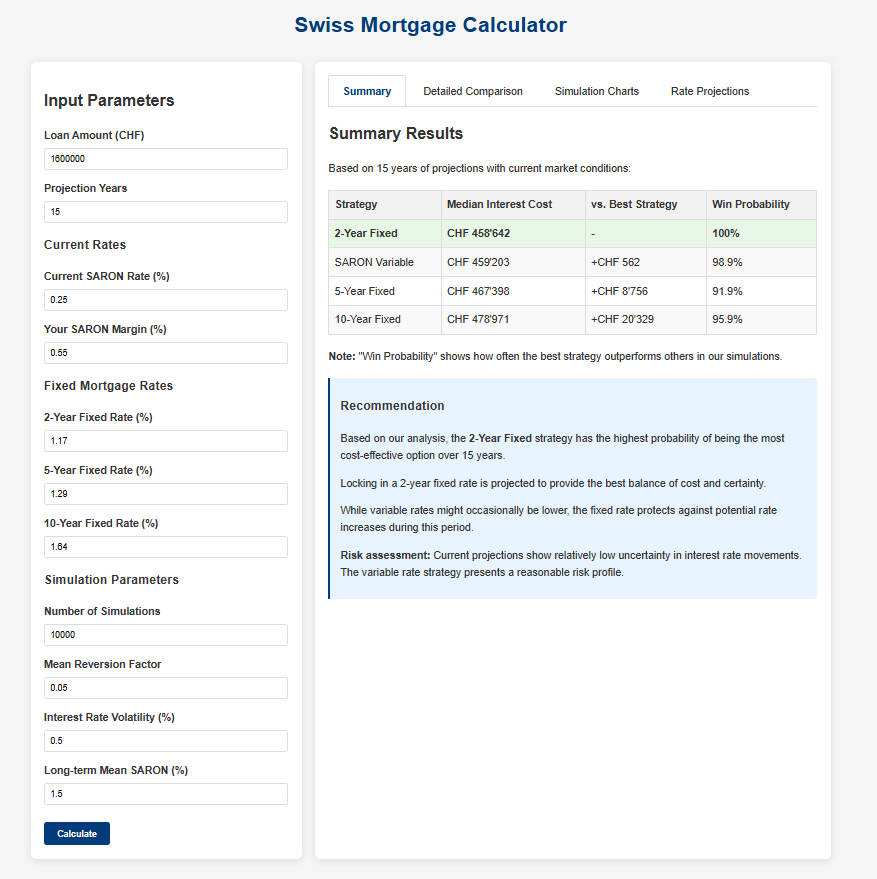
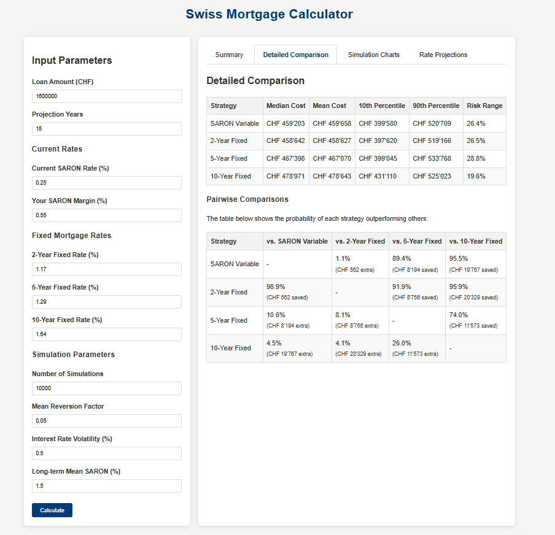
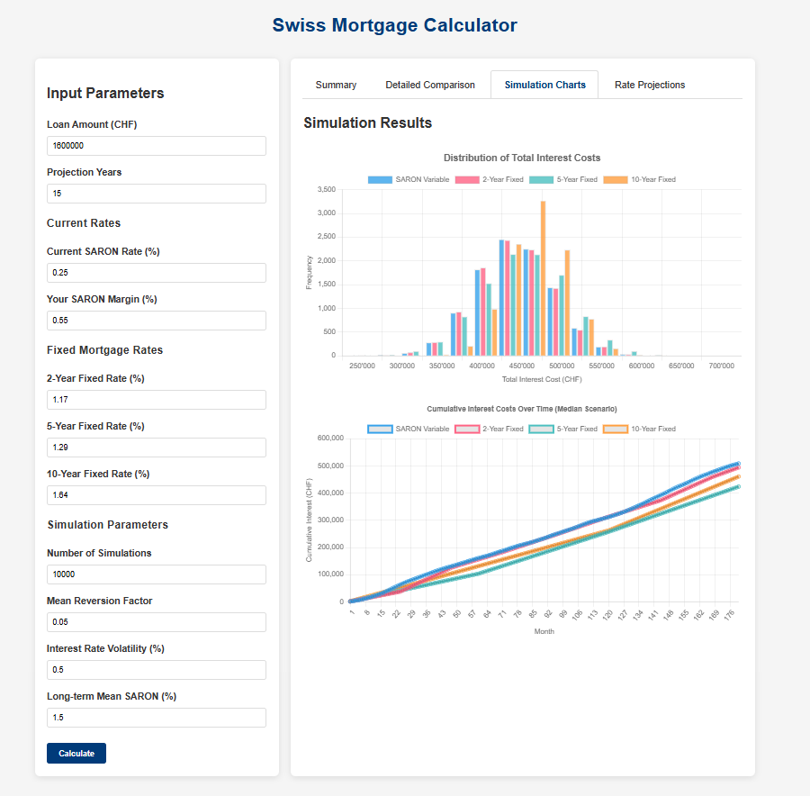
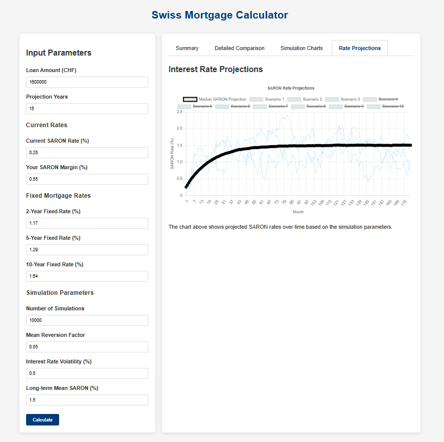

# Swiss Mortgage Calculator

A sophisticated web-based tool for comparing different mortgage strategies in the Swiss market, helping borrowers make informed decisions based on interest rate simulations.



## Features

- Compare multiple mortgage strategies: SARON variable rate, 2-year fixed, 5-year fixed, and 10-year fixed
- Monte Carlo simulation of future interest rate scenarios
- Detailed cost analysis with probability distributions
- Dynamic charts for visualizing results
- Customizable parameters for tailored analysis
- Risk assessment and strategy recommendations
- URL parameter support for saving and sharing scenarios

## Live Demo

[View the Swiss Mortgage Calculator](https://your-github-username.github.io/swiss-mortgage-calculator/)

## Screenshots

### Summary Results


The Summary tab provides an overall assessment of different mortgage strategies:

- **Strategy Comparison Table**: Shows each mortgage option with its median interest cost over the full projection period. The best strategy is highlighted.
- **Cost Difference**: Displays how much extra you would pay with each strategy compared to the optimal choice.
- **Win Probability**: Shows the percentage of simulated scenarios where the recommended strategy outperforms others.
- **Recommendation Box**: Provides a personalized recommendation based on the simulation results, highlighting expected savings and explaining the reasoning behind the recommendation.
- **Risk Assessment**: Evaluates the uncertainty level in the projections, helping you understand if the variable rate carries significant risk.

### Detailed Comparison


The Detailed Comparison tab offers a comprehensive analysis of the competing mortgage strategies:

- **Strategy Statistics**: For each strategy, shows median cost, mean cost, and cost ranges (10th and 90th percentiles) to understand the best-case and worst-case scenarios.
- **Risk Range**: Indicates the percentage spread between good and bad outcomes for each strategy, helping you assess volatility.
- **Pairwise Comparisons**: A matrix showing how often each strategy beats the others in head-to-head comparisons.
- **Expected Savings**: Shows the median amount saved or extra cost when choosing one strategy over another.

This tab helps you understand not just which strategy is best on average, but how the strategies perform relative to each other in different interest rate environments.

### Simulation Charts


The Simulation tab visualizes the distribution of outcomes across thousands of interest rate scenarios:

- **Cost Distribution Chart**: A histogram showing the frequency distribution of total interest costs for each strategy. This helps you see not just the average outcome but the full range of possibilities.
   - **X-axis**: Total interest cost in CHF
   - **Y-axis**: Number of scenarios with that cost outcome
   - **Overlapping bars**: Each color represents a different mortgage strategy
   - **Wide bars**: More common outcomes
   - **Tail ends**: Represent best and worst-case scenarios

- **Cumulative Cost Chart**: Shows how interest costs accumulate over time in the median scenario.
   - **X-axis**: Months from the starting point
   - **Y-axis**: Total accumulated interest paid in CHF
   - **Lines**: Each line represents a different mortgage strategy
   - **Steeper slopes**: Indicate periods of higher interest payments

These visualizations help you understand both the total cost differences and how costs evolve over the life of the mortgage.

### Rate Projections


The Rate Projections tab shows how SARON rates might evolve in the future:

- **Median Path**: The thick black line shows the median projected SARON rate over time.
- **Sample Scenarios**: The thinner blue lines show individual sample paths from the simulation, giving you a sense of the range of possibilities.
- **X-axis**: Months from the current date
- **Y-axis**: SARON rate in percentage

This chart helps you understand:
- The expected trajectory of interest rates
- How much variation exists in the potential rate paths
- The likelihood of significant rate increases or decreases
- The impact of mean reversion (tendency of rates to return to a long-term average)

Understanding projected rate movements is key to evaluating fixed vs. variable rate strategies.

## How It Works

The Swiss Mortgage Calculator uses stochastic modeling to simulate thousands of potential interest rate scenarios. Here's how it works:

1. **Input Parameters**: Users enter their loan amount, current rates, and simulation parameters.

2. **Interest Rate Modeling**: The calculator uses a mean-reverting stochastic process (Ornstein-Uhlenbeck) to generate realistic interest rate paths.

3. **Strategy Simulation**: For each interest rate scenario, the calculator computes the total interest cost for different mortgage strategies:
   - **SARON Variable**: Interest costs follow the simulated SARON rate plus a margin
   - **Fixed Rate Options**: Initial fixed periods use current market rates, followed by renewals based on projected rates at renewal time

4. **Statistical Analysis**: The results are analyzed to determine:
   - Median and mean costs for each strategy
   - Win probabilities between strategies
   - Risk ranges and uncertainty assessments

5. **Visualization**: Results are presented through interactive charts and tables for easy comparison

## Technical Details

### Interest Rate Modeling

The calculator uses the following formula to model interest rate paths:

```
dr = a(θ-r)dt + σdW
```

Where:
- `r` is the current interest rate
- `a` is the mean reversion factor
- `θ` is the long-term mean
- `σ` is the volatility
- `dW` is a Wiener process (random walk)

### Fixed Rate Renewals

When fixed rates expire, the model calculates new rates based on:
- The simulated SARON rate at renewal time
- A duration-specific margin (0.6% for 2-year, 0.8% for 5-year, 1.2% for 10-year)
- A minimum fixed rate of 0.5%

### Default Parameters

The calculator comes with sensible defaults for the Swiss market:
- Current SARON rate: 0.25%
- SARON margin: 0.55%
- 2-year fixed rate: 1.17%
- 5-year fixed rate: 1.29%
- 10-year fixed rate: 1.64%
- Mean reversion factor: 0.3
- Long-term mean: 0.3%
- Interest rate volatility: 0.5%

## Installation

The calculator is a client-side application with no server dependencies. To run it locally:

1. Clone the repository:
```
git clone https://github.com/your-github-username/swiss-mortgage-calculator.git
```

2. Open `index.html` in your browser

## URL Parameters

You can share specific scenarios by using URL parameters:

- `loan`: Loan amount in CHF
- `years`: Projection years
- `saron`: Current SARON rate (%)
- `margin`: SARON margin (%)
- `fixed2y`: 2-year fixed rate (%)
- `fixed5y`: 5-year fixed rate (%)
- `fixed10y`: 10-year fixed rate (%)
- `sims`: Number of simulations
- `reversion`: Mean reversion factor
- `vol`: Interest rate volatility (%)
- `mean`: Long-term mean SARON rate (%)

Example:
```
https://your-github-username.github.io/swiss-mortgage-calculator/?loan=1000000&years=15&saron=0.25
```

## Technologies Used

- HTML5, CSS3
- JavaScript (ES6+)
- Chart.js for data visualization

## Limitations and Disclaimers

- This calculator provides hypothetical scenarios based on stochastic modeling and should not be considered financial advice.
- The simulator makes assumptions about future interest rate behavior that may not reflect actual market outcomes.
- Always consult with a financial advisor before making mortgage decisions.

## Future Improvements

- Add amortization calculation
- Include additional mortgage strategies
- Support for different currencies
- Export results as PDF or CSV


## Author

Carsten Ludwig - with the help of Claude 3.7

## Acknowledgments

- Claude 3.7
- Chart.js library for visualization
- JStatistics for statistical computing
